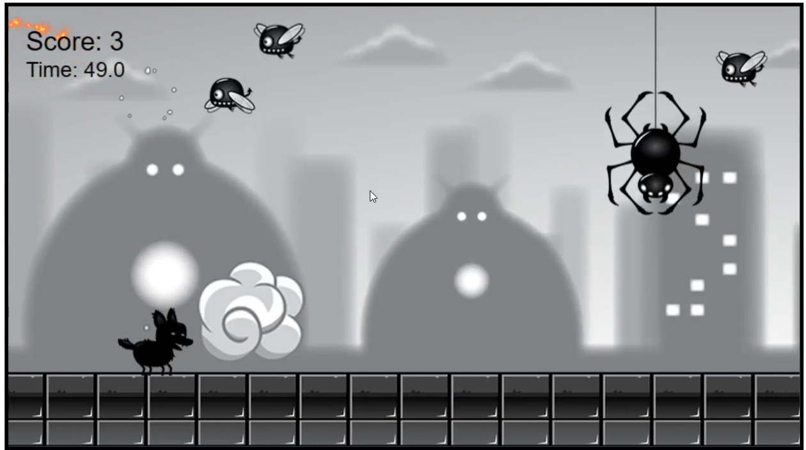
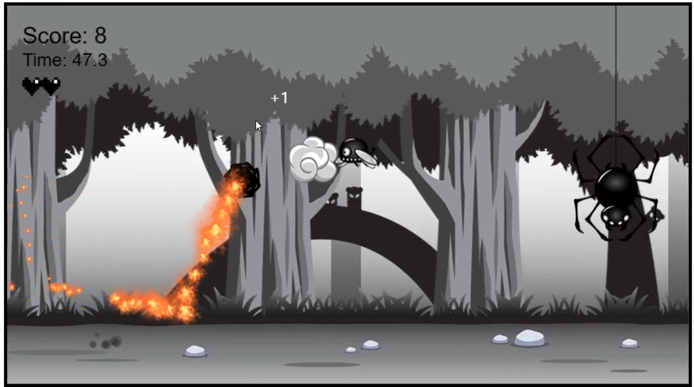

# Simple-JS-Game-RollingDog
A simple vanilla JS game: The Rolling Dog

# Demo
The City Version

The Forest Version

# Run
This project uses JavaScript with modules, so you have to run this code in a local server!   
(The original code is from FreeCodeCamp.org)

